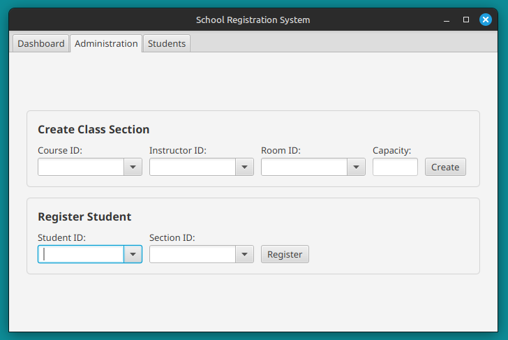

# School Registration System
A desktop administrative application for a college registrar.  
  


## Table of Contents
* [Quick Start](#quick-start)
* [Project File Structure](#project-file-structure)
* [Task Distribution Table](#task-distribution-table)
* [Project Modifications](#project-modifications)
* [Architecture Diagram](#architecture-diagram)

## Quick Start

```bash
mvn clean javafx:run
```

## Project File Structure

```
school-registration-system
├── data
│   ├── Classroom.csv
│   ├── ClassSession.csv
│   ├── Course.csv
│   ├── Instructor.csv
│   └── Student.csv
└── src
    ├── main
    │   ├── java
    │   │   └── com
    │   │       └── school
    │   │           └── app
    │   │               ├── controller
    │   │               │    ├── AdministrationSceneController.java
    │   │               │    ├── DashboardSceneController.java
    │   │               │    ├── StudentSceneController.java
    │   │               │    └── MainSceneController.java
    │   │               ├── model
    │   │               │    ├── ClassSession.java
    │   │               │    ├── Classroom.java
    │   │               │    ├── Course.java
    │   │               │    ├── Instructor.java
    │   │               │    └── Student.java
    │   │               ├── service
    │   │               │    ├── ClassroomService.java
    │   │               │    ├── RegistrationService.java
    │   │               │    ├── CourseService.java
    │   │               │    ├── InstructorService.java
    │   │               │    └── StudentService.java
    │   │               ├── Main.java
    │   └── module-info.java
    └── resources
        └── com
            └── school
                └── app
                    └── view
                        ├── administrationScene.fxml
                        ├── dashboardScene.fxml
                        ├── studentScene.fxml
                        └── mainScene.fxml
```

## Task Distribution Table  

### Models
| Task | Assigned To | Status |
| ------------- | -------------- | -------------- |
| Course.java | Isaias | Completed |
| Classroom.java | Camille | Completed |
| Student.java | Jhonatan | Completed |
| ClassSession.java | Jhonatan | Completed |
| Instructor.java | Jhonatan | Completed |

### Services
| Task | Assigned To | Status |
| ------------- | -------------- | -------------- |
| InstructorService.java | Jhonatan | Completed |
| RegistrationService.java | Jhonatan | Completed |
| CourseService.java | Isaias | Completed |
| ClassroomService.java | Camille | Completed |
| ClassSessionService.java | Jhonatan | Completed |
| StudentService.java | Jhonatan | Completed |

### Setters
| Task | Assigned To | Status |
| ------------- | -------------- | -------------- |
| Define setters for Student.java | Camille | Completed |
| Define setters for Instructor.java | Isaias | Completed |
| Define setters for Course.java | Isaias | Completed |

### Controllers
| Task | Assigned To | Status |
| ------------- | -------------- | -------------- |
| MainSceneController.java | Jhonatan | Completed |
| AdministrationSceneController.java | Jhonatan | Completed |
| DashboardSceneController.java | Jhonatan | Completed |
| StudentSceneController.java | Jhonatan | Completed |

### GUI View
| Task | Assigned To | Status |
| ------------- | -------------- | -------------- |
| administrationScene.fxml | Jhonatan | Completed |
| dashboardScene.fxml | Jhonatan | Completed |
| studentScene.fxml | Jhonatan | Completed |
| mainScene.fxml | Jhonatan | Completed |

