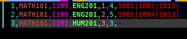
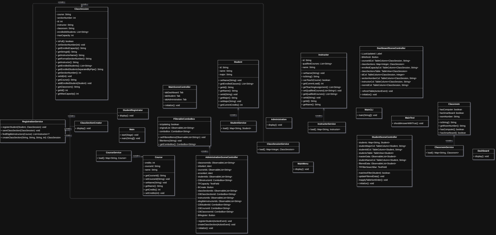

# School Registration System
A desktop administrative application for a college registrar.  
  


## Table of Contents
* [Usage](#usage)
* [Project File Structure](#project-file-structure)
* [Task Distribution Table](#task-distribution-table)
* [Project Modifications](#project-modifications)
* [Architecture Diagram](#architecture-diagram)

## Usage

To run the CLI application, use this command:

```bash
bash compile-and-run.sh
```

To run the GUI application, install Apache Maven and use this command:

```bash
mvn clean javafx:run
```

## Project File Structure

```
school-registration-system
├── data
│   ├── Classroom.csv
│   ├── ClassSession.csv
│   ├── Course.csv
│   ├── Instructor.csv
│   └── Student.csv
└── src
    ├── main
    │   ├── java
    │   │   └── com
    │   │       └── school
    │   │           └── app
    │   │               ├── controller
    │   │               │    ├── AdministrationSceneController.java
    │   │               │    ├── DashboardSceneController.java
    │   │               │    ├── StudentSceneController.java
    │   │               │    ├── FilterableComboBox.java
    │   │               │    └── MainSceneController.java
    │   │               ├── model
    │   │               │    ├── ClassSession.java
    │   │               │    ├── Classroom.java
    │   │               │    ├── Course.java
    │   │               │    ├── Instructor.java
    │   │               │    └── Student.java
    │   │               ├── service
    │   │               │    ├── ClassroomService.java
    │   │               │    ├── RegistrationService.java
    │   │               │    ├── CourseService.java
    │   │               │    ├── InstructorService.java
    │   │               │    └── StudentService.java
    │   │               ├── view
    │   │               │    └── cli
    │   │               │        ├── Administration.java
    │   │               │        ├── ClassSectionCreator.java
    │   │               │        ├── StudentRegistrator.java
    │   │               │        ├── Dashboard.java
    │   │               │        └── MainMenu.java
    │   │               ├── Main.java
    │   │               └── MainCLI.java
    │   └── module-info.java
    └── resources
        └── com
            └── school
                └── app
                    └── view
                        ├── administrationScene.fxml
                        ├── dashboardScene.fxml
                        ├── studentScene.fxml
                        └── mainScene.fxml
```

## Task Distribution Table  

### Models
| Task | Assigned To | Status |
| ------------- | -------------- | -------------- |
| Course.java | Isaias | Completed |
| Classroom.java | Camille | Completed |
| Student.java | Jhonatan | Completed |
| ClassSession.java | Jhonatan | Completed |
| Instructor.java | Jhonatan | Completed |

### Services
| Task | Assigned To | Status |
| ------------- | -------------- | -------------- |
| InstructorService.java | Jhonatan | Completed |
| RegistrationService.java | Jhonatan | Completed |
| CourseService.java | Isaias | Completed |
| ClassroomService.java | Camille | Completed |
| ClassSessionService.java | Jhonatan | Completed |
| StudentService.java | Jhonatan | Completed |

### Setters
| Task | Assigned To | Status |
| ------------- | -------------- | -------------- |
| Define setters for Student.java | Camille | Completed |
| Define setters for Instructor.java | Isaias | Completed |
| Define setters for Course.java | Isaias | Completed |

### Controllers
| Task | Assigned To | Status |
| ------------- | -------------- | -------------- |
| MainSceneController.java | Jhonatan | Completed |
| AdministrationSceneController.java | Jhonatan | Completed |
| DashboardSceneController.java | Jhonatan | Completed |
| StudentSceneController.java | Jhonatan | Completed |


### CLI View
| Task | Assigned To | Status |
| ------------- | -------------- | -------------- |
| Dashboard.java | Camille | Completed |
| Administration.java | Jhonatan | Completed |
| MainMenu.java | Jhonatan | Completed |
| ClassSectionCreator.java | Jhonatan | Completed |
| StudentRegistrator.java | Jhonatan | Completed |

### GUI View
| Task | Assigned To | Status |
| ------------- | -------------- | -------------- |
| administrationScene.fxml | Jhonatan | Completed |
| dashboardScene.fxml | Jhonatan | Completed |
| studentScene.fxml | Jhonatan | Completed |
| mainScene.fxml | Jhonatan | Completed |

## Project Modifications

In the description of Project1.pdf it is not specified to create the ClassSession.csv file present in this repository. However, the ClassSession.java and ClassSessionService.java files are. So, I thought it would be natural to include a ClassSession.csv file just like the other CSV files have their corresponding service and model counterparts. This helped us to make the application more modular.  
  

  
Another important modification we made was deciding to use String and primitive data types for the model classes. For example, Project1.pdf says that ClassSession.java must have the field "course" of type Course, but we declare the field as a String type. In it, we stored the Course ID as a String rather than a Course object. The reason of this is that putting models in models causes an Stack Overflow due to how our service classes load and parse the data that go into the models. For example, to get the enrolled students metric in ClassSessionService.java, we must invoke the StudentService.java file to get the Student instances. But, in StudentService.java, we need the enrolled classes list of type ClassSession, so we must invoke ClassSessionService.java. This generates a loop, so that is why we decided to use Strings, because we can store the information and retrieve the associated objects from the maps later in the models or controllers using the stored IDs.

The last and most important modification was to use the JavaFX graphics library rather than Swing. The reason of this was because of JavaFX's modern-looking UI and its compatibility with FXML files. In this way, creating interfaces can be made quickly using for example Scene Builder. Along JavaFX and FXML, we saw natural to do a model-view-controller architecture and hence, the controller directory.

## Architecture Diagram  



